# Beat Saitama! - Memory Card Game

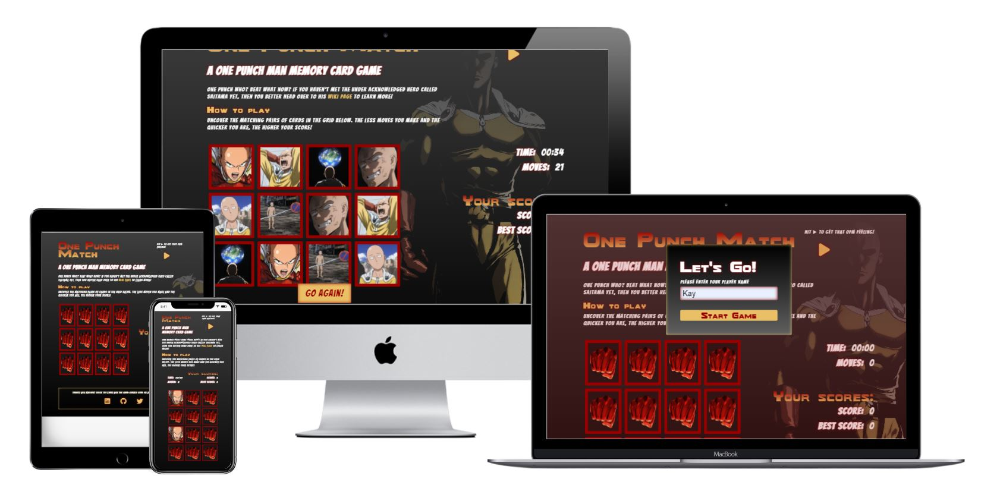

Try and beat Saitama in this One Punch Man themed memory card game where the user's aim is to find all matching picture cards in as little time as possiple.

Link to [live site](https://kathrin-ddggxh.github.io/CI-PP2_memory-card-game/)

## Index - Table of Contents

- [Design](#design)

- [Features](#features)

- [UX](#ux)

- [Credits](#credits)

## Design

This game was designed with simple, intuitive functionality in mind. All features are self-explanetory and the game itself is rather common, thus the rules are well known and not discussed in to much detail on the actual site. Even without initial understanding of the game, the user is able to quickly figure out how to play it by trying out the site's different features.

It is assumed that anybody coming across this game, i.e. searching for a One Punch Man card game is already aware of the protagonist the game is based on. For those who aren't, a link to the OPM wiki is found in a brief description of the character Saitama.

### Wireframes

The first [wireframes in Figma](https://www.figma.com/file/ZL7CYHIYrd1EM1fCKRbv8f/Untitled?node-id=0%3A1) show a very simple layout of the most essential features, aiming for a minimum viable product.

### Font and Colour choices

**Fonts:** Fonts were chosen to match the style of the One Punch Man manga as closely as possible. The original fonts could not be sourced unfortunately.

**Colours:** The main colour scheme follows the design of the anime, maintaining a dark mood based on the main red colour found in Saitama's (One Punch Man protagonist) cape, gloves and boots.

## Features

The site contains all necessary features of a simple, functioning memory card game.

### Existing Features

- **Modal with Start Game Button**
    - Displays when site first loads
    - Enables the user to enter a player name
    - Game works even without entering a player name

    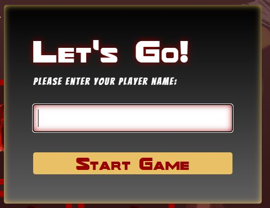

- **Heading**
    - Displays name of the site and sub-heading
    - Located at the top of the site

    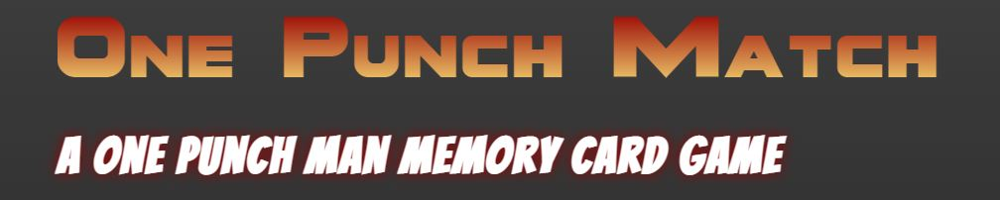

- **Sound Toggle**
    - Located at the top right of the site
    - Enables user to play and pause OPM theme tune
    - Button changes according to play or pause functionality

    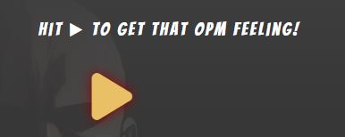 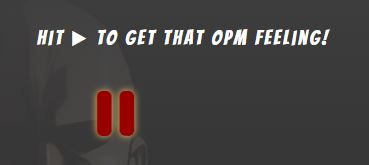

- **Theme Introduction**
    - Located below the heading
    - Provides very brief introduction to the game's character Saitama from the manga and anime One Punch Man
    - Provides link to OPM wiki page for more detailed information

    

- **Game Rules**
    - Located between OPM info and game area
    - Informs the user in rudimentary terms of how to play the game
    - Informs the user of how the score is calculated

    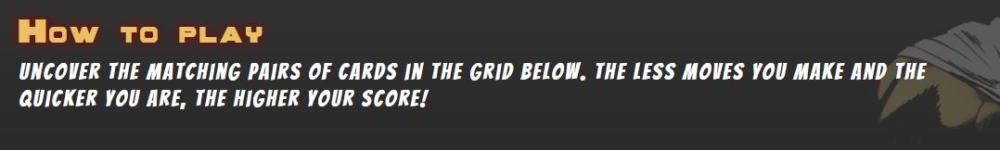

- **Game Area**
    - The main feature of the site
    - A grid of 12 cards (6 matching pairs), depicting various scenes featuring Saitama 
    - Cards appear face down at the start of the game
    - On click, cards are turned face up. Matching pairs remain face up. Non-matching cards get flipped back face down.

    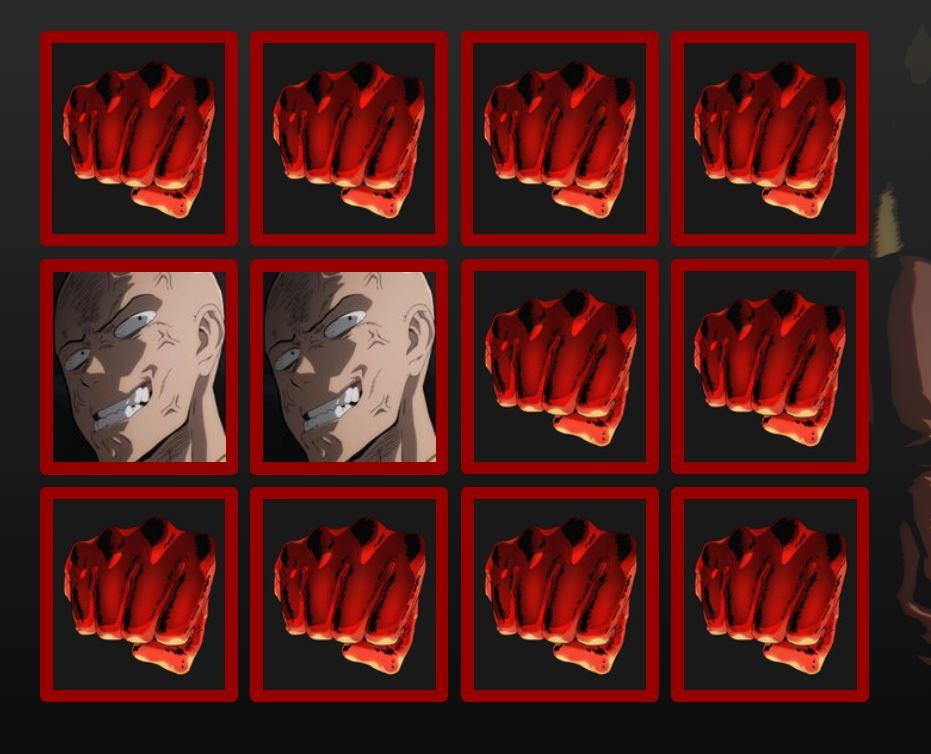

- **Timer and Moves Counter**
    - On large screens to the right of the game area
    - Above game area on small screens
    - Timer starts as soon as user clicks Start Game button or restart button
    - Timer stops when game is completed
    - Moves counter increments by 1 every time the user clicks on a card

    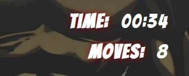

- **Score Area**
    - displays current score, calculated after each completion of the game
    - stores and displays best score of every session

    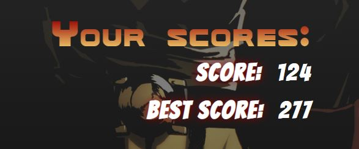

- **Name Display**
    - The player's name as entered in the modal's input field is displayed in the heading of the score area
    - Should the user not enter a player name, the heading will default to "Your Scores"

    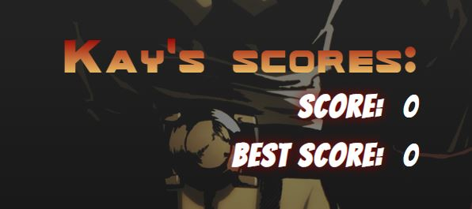

- **Restart Button**
    - Appears on top of game area when the game is completed
    - On click, resets the timer, move counter and current score counter to 0
    
    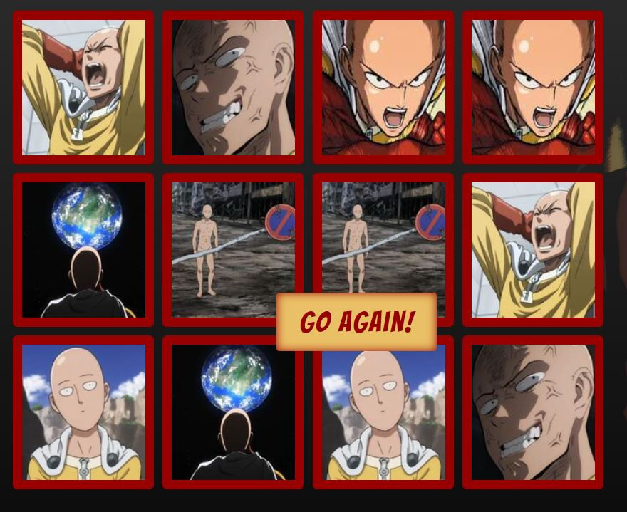

- **Footer**
    - Located at the bottom of the site
    - Contains social media icons which link to site creater's Twitter and LinkedIn profile, as well as the open-source GitHub repo of the site

    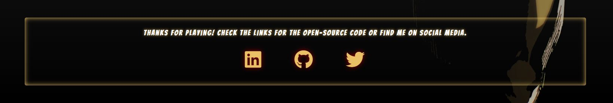

### Possible Future Features

- **Varying levels of difficulty**
    - Enable the user to choose between different levels of difficulty
    - The higher the skill level, the more cards in the grid

- **Manga/Anime toggle**
    - Enable the user to choose a theme
    - Anime theme: the cards will depict coloured scenes from the OPM anime show
    - Manga theme: the cards will depict b/w scenes from the manga

- **Sound effects**
    - Enables the user to toggle sound effects for flipping the cards and completing the game

## UX

### Site Goals

The goal of the site is to provide the fan community of One Punch Man with an entertaining yet not too complicated game, featuring images of the anime series.

The game is intended to be played over the course of a few minutes. It does not take up too much of the user's time either by playing or learning the rules and functionality.

### User Stories

**As a site visitor I want to:**

- be able to enter a player name that then displays on the site
- get a quick and thorough overview of the sites features and functionalities
- find a short and snappy blurb about the site's theme
- see a link to a site providing me with more detailed information about the site's theme
- find a visually appealing design that connects me with the theme of One Punch Man
- be able to listen a short soundtrack that emphasises the One Punch Man theme (and puts me in a good mood because the tune is epic!)
- read a brief and simple description of the game rules and score calculation
- be able to play the game with simple click interaction
- see the time that has elapsed while playing the game
- see a move counter recording the amount of clicks I perform
- see my current score calculated after completing one round of the game
- see my highest score displayed while playing more rounds
- be able to restart the game without reloading the page
- be able to find the site's creator on social media
- see a link that takes me to the GitHub repo of the site's open-source code

**As the site administrator I want to:**

- be able to make modifications to the game (see [future features](#possible-future-features))
- provide the user with social media contacts
- offer the user the chance to explore the code for the site

## Testing

### Validator Testing

- HTML ([W3C validator](https://validator.w3.org/))

    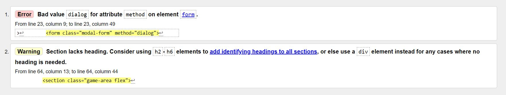
    - **Error** : Bad value `dialog` for attribute `method` on element `form`

        In order to close the modal upon form submission, the value of `dialog` is actually required for the form element's `method` attribute in this case. 

        Refer to [this tutorial](https://www.youtube.com/watch?v=TAB_v6yBXIE&t=300s) for further explanation.

        The `dialog` HTML element and `::backdrop` property have only recently (15/03/2022) gained support from Safari and are now supported by all major browsers.

    - **Warning** *Section lacks heading*:

        A heading that appears visually for on the site above the game area would not suit the general layout and design.
        
        **Solution**: In order to improve accessibility, an `aria-label` attribute was added to the section.

- CSS [Jigsaw](https://jigsaw.w3.org/css-validator/)

    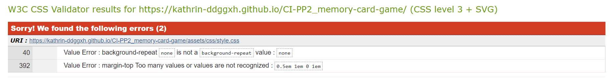

    - **Value Error** : background-repeat `none` is not a background-repeat value : `none`

        **Solution** : change background-repeat value to `no-repeat`

    - **Value Error** : margin-top Too many values or values are not recognized : `0.5em 1em 0 1em`

        **Solution** : remove `margin` property for `.score-heading` element on line 392 altogether - unnecessary!

        
### Browser Testing

### Manual Testing

### Testing User Stories

### Fixed bugs

### Unfixed bugs

## Deployment

This site was deployed via GitHub pages using the following steps:
- From the GitHub repository, navigate to **Settings**
- In the left-hand navigation section select **Pages**
- From the source section drop-down menu change Branch from **none** to **main** and click the **Save**
- After several minutes the website is live and will be automatically refreshed with each Git push command.

The link to the live site is: https://kathrin-ddggxh.github.io/CI-PP2_memory-card-game/ 

To run locally:
- Log into GitHub and click on repository to download ([CI-PP2_memory-card-game](https://github.com/Kathrin-ddggxh/CI-PP2_memory-card-game))
- Select **Code** and click "Download the Zip file.
- Once download is completed, extract ZIP file and use in your local environment.

Alternatively you can **Clone** or **Fork** this repository into your GitHub account.

## Credits

### Media

**Images:**

- *angry:* https://onepunchman.fandom.com/wiki/Saitama_vs._Mosquito?file=Pissedtama_Anime.png
- *bargain-sale*: https://onepunchman.fandom.com/wiki/Saitama_vs._Subterranean_King?file=Saitama_when_knowing_he_will_miss_a_bargain_sale.png#Battle
- *card-back*: https://www.logolynx.com/topic/one+punch+man
- *confused-look*: https://winteriscoming.net/2022/06/14/fast-furious-director-making-live-action-one-punch-man-movie/
- *earth*: https://onepunchman.fandom.com/wiki/Saitama_vs._Mosquito?file=Saitama_watching_the_Earth_from_the_Moon.png
- *naked*: https://onepunchman.fandom.com/wiki/Saitama_vs._Mosquito?file=Naked_saitama.png
- *punch-face*: https://www.giantfreakinrobot.com/ent/one-punch-man-justin-lin.html
- *background*: https://wall.alphacoders.com/tag/4k-saitama-%28one%E2%80%93punch-man%29-wallpapers 
- *favicon*: https://read1.mangaonepunch.com/

**Audio**

- *soundtrack:* https://www.youtube.com/watch?v=rW7OB_HDCGQ&ab_channel=THESAMO

### Code

#### Functionality

- [Memory Card Game](https://medium.com/free-code-camp/vanilla-javascript-tutorial-build-a-memory-game-in-30-minutes-e542c4447eae)

- [Timer functionality](https://daily-dev-tips.com/posts/vanilla-javascript-timer/)

- [Soundtrack toggle](https://stackoverflow.com/questions/27368778/how-to-toggle-audio-play-pause-with-one-button-or-link)

- [HTML data attributes](https://developer.mozilla.org/en-US/docs/Learn/HTML/Howto/Use_data_attributes)

- [Flex order property](https://marina-ferreira.github.io/tutorials/css/flexbox/#order)

- [JavaScript setTimeout() method](https://www.w3schools.com/jsref/met_win_settimeout.asp)

- [JavaScript destructuring assignment](https://developer.mozilla.org/en-US/docs/Web/JavaScript/Reference/Operators/Destructuring_assignment)

- [JavaScript IIFE](https://developer.mozilla.org/en-US/docs/Glossary/IIFE)

#### Styling effects and animations
- [CSS perspective property](https://developer.mozilla.org/en-US/docs/Web/CSS/perspective)
- [CSS transform-style Property](https://developer.mozilla.org/en-US/docs/Web/CSS/transform-style)
- [Text colour gradient](https://css-tricks.com/snippets/css/gradient-text/)

### Content
**Fonts** 

*Bangers:* [Google fonts](https://fonts.google.com/)

*wild_world:* [Abdullah Mosad](https://befonts.com/wild-world-font.html) (License: Free for Commercial Use); converted into web font kit with [Fontsquirrel](https://www.fontsquirrel.com/tools/webfont-generator) 

**Icons** 

All icons were taken from [Font Awesome](https://fontawesome.com/icons)